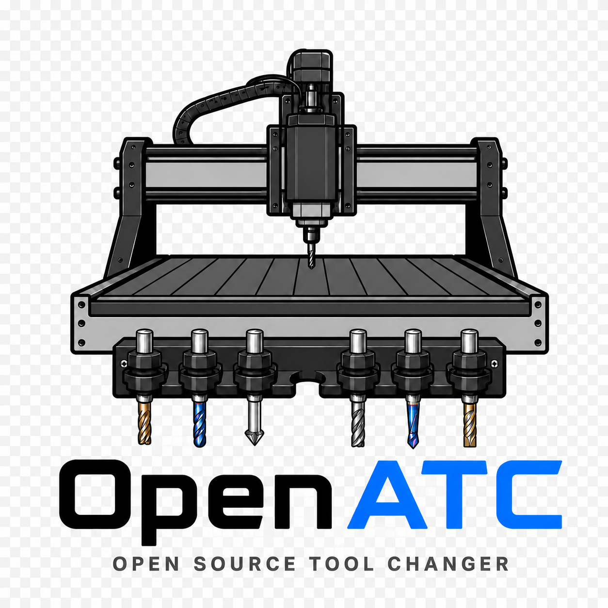

<p align="center">
  
</p>

<p align="center">
  <strong>
    OpenATC is experimental software. There is no guarantee that it will operate
    correctly, safely, or without causing machine, spindle, tooling, workpiece,
    or fixture damage.
  </strong>
</p>

<p align="center">
  
</p>

# OpenATC

OpenATC is an open source automatic tool changer concept for FluidNC-powered
hobby CNC routers and mills. It is designed around a linear, bed-mounted tool
magazine that sits along the machine X or Y axis and uses controlled spindle
motion to pick up, return, tighten, and loosen tools.

This project is for builders who want a practical, inspectable tool changer
stack instead of a closed black box. The current focus is a magazine-style
changer for Cartesian X/Y/Z machines, with toolsetter probing for dynamic tool
length offsets.

## Status

OpenATC is experimental. Automatic tool changing moves the spindle into fixed
hardware, starts and stops the spindle intentionally, and can damage the machine
if coordinates, directions, speeds, homing, or toolholding are wrong.

Before running an automatic change:

- Verify all machine coordinates with no cutter installed.
- Confirm homing, soft limits, safe Z, and emergency stop behavior.
- Confirm spindle CW and CCW behavior at low speed.
- Test one motion phase at a time before allowing a complete tool change.
- Keep hands clear of the machine whenever FluidNC is armed.

## What It Supports

The native FluidNC patch set in this repository targets:

- FluidNC firmware.
- Cartesian X/Y/Z machines.
- Linear bed-mounted magazines along X or Y.
- Tool numbers `1..pocket_count`.
- Tool `0` as an empty spindle.
- Safe machine-coordinate moves with `G53`.
- Toolsetter probing with `G38.2`.
- Dynamic tool length offsets with `G43.1`.
- TLO clearing with `G49`.
- Optional tool-detection checks with one unload retry when configured.

The first native implementation does not target carousel, turret, multi-row,
side-mounted, or random-pocket changers.

## How It Works

OpenATC treats the magazine as a measured row of pockets:

1. FluidNC is homed and the current tool state is declared.
2. `Tn M6` requests a tool change.
3. The native ATC validates the requested tool, current tool, homing state,
   machine bounds, spindle direction support, and optional tool detection.
4. The machine moves to safe Z.
5. The spindle moves to the current pocket and unloads the current tool when
   needed.
6. The spindle moves to the requested pocket and loads the new tool.
7. The machine probes the toolsetter.
8. FluidNC applies the dynamic Z tool length offset.

`M61 Qn` declares the current tool without motion. Use `M61 Q0` when the
spindle is empty. After the machine is configured, homed, and verified, `Tn M6`
requests a change to tool `n`; `T0 M6` returns the current tool and leaves the
spindle empty.

All OpenATC configuration distances are machine coordinates in millimeters. If
FluidNC is in inch mode before a tool change, the native job temporarily switches
to metric motion for the OpenATC sequence and restores inch mode afterward.

Optional tool detection uses FluidNC's logical pin state. Configure
normally-open or normally-closed wiring so logical `true` means the tool blocks
the beam while held in the spindle. After load, OpenATC expects the beam to be
blocked. After unload, it expects the beam to be clear because the tool was
dropped into the pocket. If a failed unload is detected, OpenATC retracts using
the load `retract_between_passes_mm` distance, tries one more unload pass, then
alarms if the sensor state is still wrong.

## FluidNC Native Patch Set

The current native implementation is provided as ordered FluidNC patches:

```text
patches/fluidnc/
  BASE_COMMIT.txt
  0001-add-openatc-native-toolchanger.patch
  0002-add-openatc-example-config.patch
  0003-add-openatc-tests-and-fixtures.patch
  0004-Allow-signed-OpenATC-pocket-pitch.patch
```

Apply them to the FluidNC commit they were prepared against:

```bash
git clone https://github.com/bdring/FluidNC.git
cd FluidNC
git checkout 4aa40185c861fe4abad17a592673c827e0298697
git am /path/to/OpenATC/patches/fluidnc/*.patch
```

`patches/fluidnc/BASE_COMMIT.txt` records the FluidNC base commit, patch
order, and verification commands used for this release.

Build the patched firmware with PlatformIO from the FluidNC checkout:

```bash
pio run -e wifi
```

After applying the patches, configure a spindle with:

```yaml
atc: openatc
```

Use the included `openatc_linear.yaml` example from the patched FluidNC tree as
a starting point. Replace every machine coordinate with values measured on your
machine. Do not run a complete automatic change until each safe-Z, pocket,
engage-Z, and toolsetter position has been verified without a cutter installed.
Use a positive `pocket_pitch_mm` when pocket numbers increase toward machine
X+/Y+, or a negative value when they increase toward X-/Y-.

## Config Wizard

The OpenATC Config Wizard helps generate the `openatc:` YAML section and can
merge it into an existing FluidNC config in your browser:

```text
https://darkslaayer.github.io/OpenATC/
```

The wizard is millimeters-only and does not upload your config anywhere.

## Bring-Up Checklist

1. Back up your working FluidNC configuration.
2. Apply and build the patched FluidNC firmware.
3. Flash the firmware and confirm the machine homes correctly.
4. Configure the `openatc:` section with measured magazine and toolsetter
   coordinates.
5. Set optional tool detection to `NO_PIN` until the basic motion is proven.
6. Declare an empty spindle with `M61 Q0`.
7. Test invalid tool handling before testing real motion.
8. Test the first tool pickup with no cutter installed.
9. Add one tool at a time and verify probing and offsets.

## Repository Contents

```text
assets/
  openatc-logo.png

docs/
  GitHub Pages config wizard.

patches/fluidnc/
  Native FluidNC OpenATC patch set and base-commit manifest.
```

The native FluidNC patch set is the supported path for new builds.

## License

OpenATC is licensed under the GNU General Public License version 3 or later.
See `LICENSE` for the license notice and link to the full terms.

## Safety Notice

You are responsible for your machine, tooling, wiring, speeds, coordinates, and
testing process. OpenATC can move into rigid hardware and can start the spindle
as part of a tool change. Treat every configuration value as unsafe until you
have verified it on your own machine.
